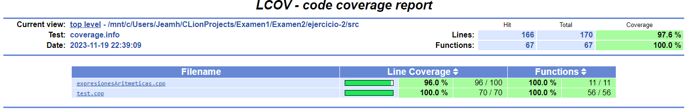
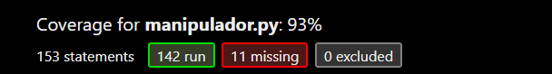

# EXAMEN 2 - CI3641

### Jeamhowards Montiel - 1910234

## Lenguaje y Herramientas Utilizados

Para la primera pregunta fue utilizado el lenguaje de programación Mercury, para las tercera pregunta y quinta pregunta el lenguaje python,
y para la segunda y cuarta fue utilizado el lenguaje de programación C++.

## Sobre los programas

### Primera Pregunta (Mercury)

Para compilar los dos programas en mercury necesita el compilador de mercury que puede descargar e instalar
desde el siguiente enlace:
```
https://mercurylang.org/
```

Los archivos fuentes de mercury tienen la extensión .m

#### Solo ejecutar los programas

Si se desea solo ejecutar los programas, se dejó en la carpeta el ejecutable para cada uno, solo ejecute

```
./ejercicio-1/ejercicio-church/church
```

```
./ejercicio-1/ejercicio-max-heap-simetrico/maxHeapSimetrico
```

#### Ejercicio Church

1.  Para compilar el programa escriba en su consola la palabra
```
mmc -o ejercicio-1/ejercicio-church/church ejercicio-1/ejercicio-church/church.m
```

2. Para ejecutar el programa escriba en su consola la palabra
```
./ejercicio-1/ejercicio-church/church
```

#### Ejercicio Max Heap Simetrico

1.  Para compilar el programa escriba en su consola la palabra
```
mmc -o ejercicio-1/ejercicio-max-heap-simetrico/maxHeapSimetrico ejercicio-1/ejercicio-max-heap-simetrico/maxHeapSimetrico.m
```

2. Para ejecutar el programa escriba en su consola la palabra
```
./ejercicio-1/ejercicio-max-heap-simetrico/maxHeapSimetrico
```

### Segunda Pregunta (C++)

1. Escribe en tu consola la palabra

```
./ejercicio-2/expresionesAritmeticas
```

Puede acceder también a las pruebas unitarias de la segunda pregunta, para ello escriba en su consola la palabra

```
./ejercicio-2/runUnitTests
```

Por último puede acceder al informe de cobertura de las pruebas unitarias, para ello abra en su navegador web el archivo

```
./ejercicio-2/coverage-report/index.html
```
Se anexan imagenes del informe



### Tercera Pregunta (Python)


1. Escribe en tu consola la palabra

```
python ejercicio-3-b/iterador.py
```

### Cuarta Pregunta (C++)

1. Escribe en tu consola la palabra

```
./ejercicio-4/recursividad
```

En la carpeta ejercicio-4 además de encontrarse el código fuente del programa, se agrega también los tiempos de
ejecución de la función para cada caso, además de un archivo PDF donde se ve la comparativa gráfica del tiempo de
ejecución.

### Quinta Pregunta (Python)

1. Escribe en tu consola la palabra

```
cd ./pregunta-5
```

2. Escribe en tu consola la palabra

```
python main.py
```

Puede acceder también a las pruebas unitarias de la quinta pregunta, para ello escriba en su consola la palabra

```
python -m unittest test.py 
```

Por último puede acceder al informe de cobertura de las pruebas unitarias, para ello abra en su navegador web el archivo

```
./pregunta-5/htmlcov/index.html
```

Se anexan imagenes del informe

